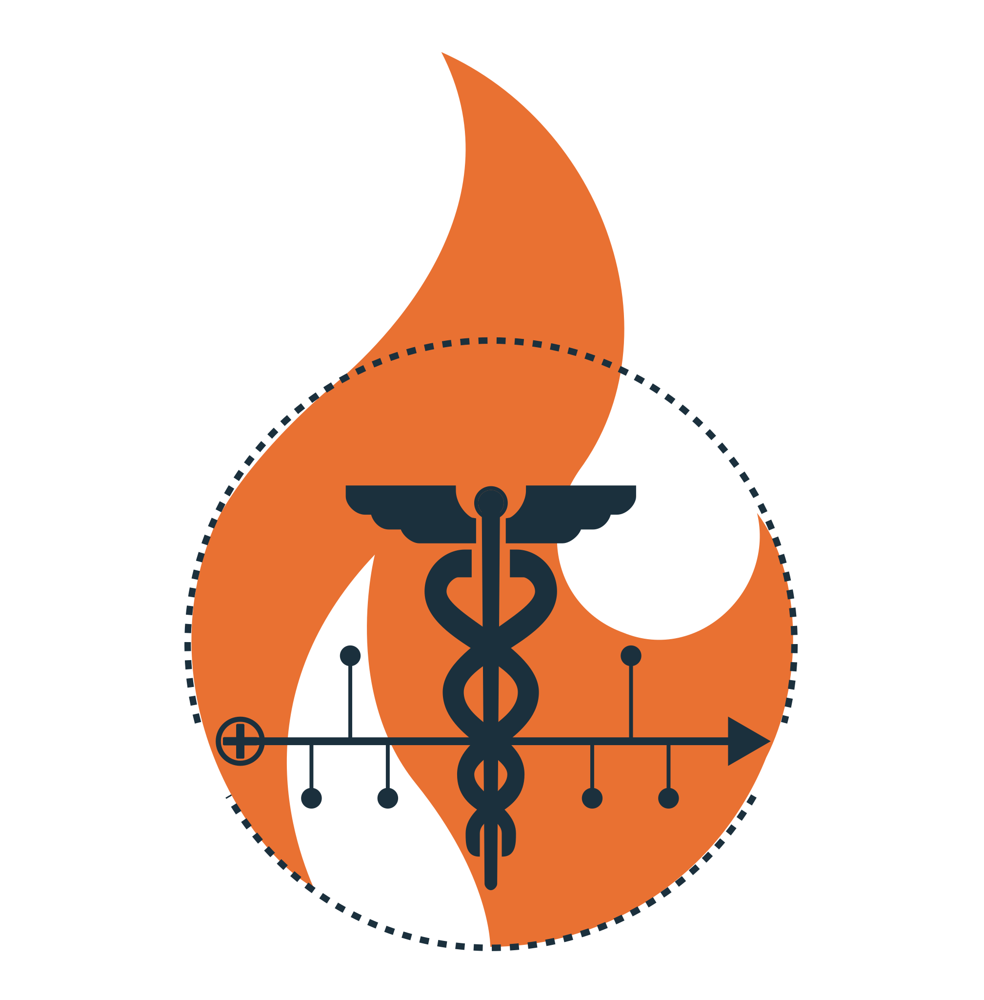

<p align="center">
  <picture>
    <source media="(prefers-color-scheme: dark)" srcset="static/meds_on_fhir_logo_light.svg">
    <source media="(prefers-color-scheme: light)" srcset="static/meds_on_fhir_logo_light.svg">
    
  </picture>
</p>

# MEDS on FHIR

[](https://pypi.org/project/fhir2meds/)
[](https://fhir2meds.readthedocs.io/en/stable/?badge=stable)
[](https://codecov.io/gh/rvandewater/FHIR_MEDS)
[](https://github.com/rvandewater/FHIR_MEDS/actions/workflows/tests.yml)
[](https://github.com/rvandewater/FHIR_MEDS/actions/workflows/code-quality-main.yaml)

[](https://github.com/rvandewater/FHIR_MEDS#license)
[](https://github.com/rvandewater/FHIR_MEDS/pulls)
[](https://github.com/rvandewater/FHIR_MEDS/graphs/contributors)

---

## Overview

**MEDS on FHIR** is a Python package for converting HL7 FHIR (v4/v5) resources into the [MEDS](https://github.com/Medical-Event-Data-Standard/meds) sharded Parquet 
format. It supports scalable, schema-validated event extraction and is designed for research and interoperability projects.
This project is in its early stages and has been tested mainly with the MIMIC-IV FHIR demo.
---

## Features
- Parses and processes all FHIR resource types (v4/v5)
- Robust mapping from FHIR Observation to MEDS event schema
- Handles patient ID resolution and vocabulary mapping
- Outputs sharded Parquet files, validated against the MEDS schema
- Parallelized, high-performance pipeline using polars and pyarrow
- Extensible: add mapping for new FHIR resource types easily
- Comprehensive test suite for FHIR resource parsing

---

## Installation

```bash
pip install fhir2meds
# or for local development
pip install -e .
```

---

## Usage

```bash
fhir2meds --input_dir path/to/mimic-fhir --output_dir path/to/meds_output --max_observations 100
```

- `--input_dir`: Directory containing FHIR .ndjson/.json files (e.g., MIMIC-IV FHIR demo)
- `--output_dir`: Output directory for MEDS Parquet shards
- `--max_observations`: (Optional) Limit number of observations for debugging
- `--overwrite`: (Optional) Overwrite existing output directory
- `--do_download`: (Optional) Download MIMIC-IV FHIR demo dataset automatically (TODO)

---

## Testing

Run the test suite (requires pytest):

```bash
PYTHONPATH=src pytest tests/
```

---

## References
- [HL7 FHIR Resource List](https://www.hl7.org/fhir/resourcelist.html)
- [MIMIC-IV FHIR Demo](https://physionet.org/content/mimic-iv-fhir-demo/2.0/)
- [MEDS Format & Schema](https://github.com/Medical-Event-Data-Standard/meds)
- [ETL_MEDS_Template](https://github.com/Medical-Event-Data-Standard/ETL_MEDS_Template)

---

## License

This project is licensed under the MIT License. See the [LICENSE](LICENSE) file for details.

---

## Contributing

Pull requests are welcome! For major changes, please open an issue first to discuss what you would like to change. 
